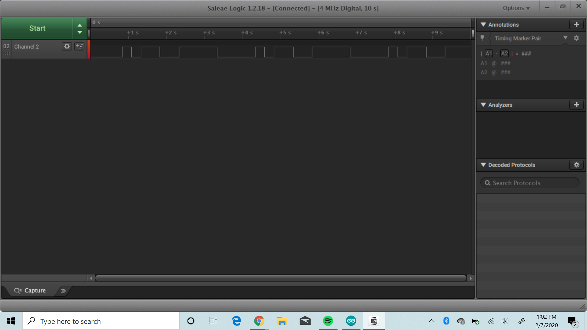
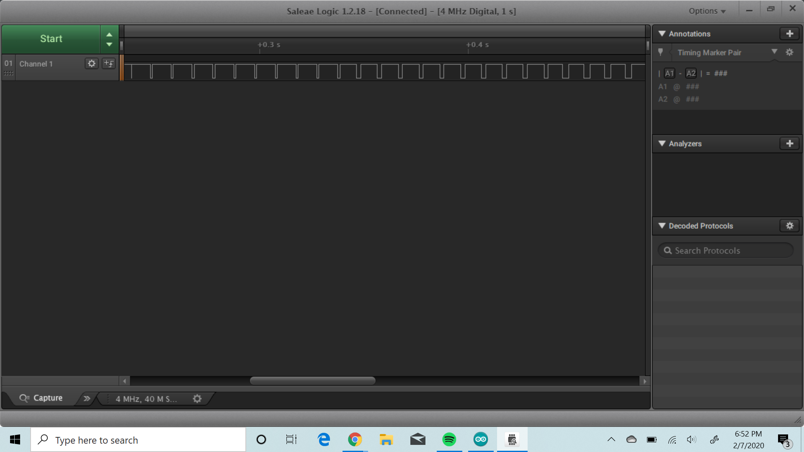
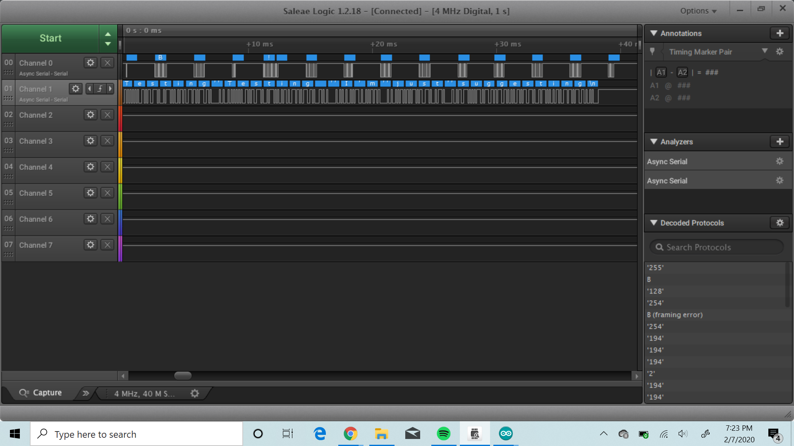
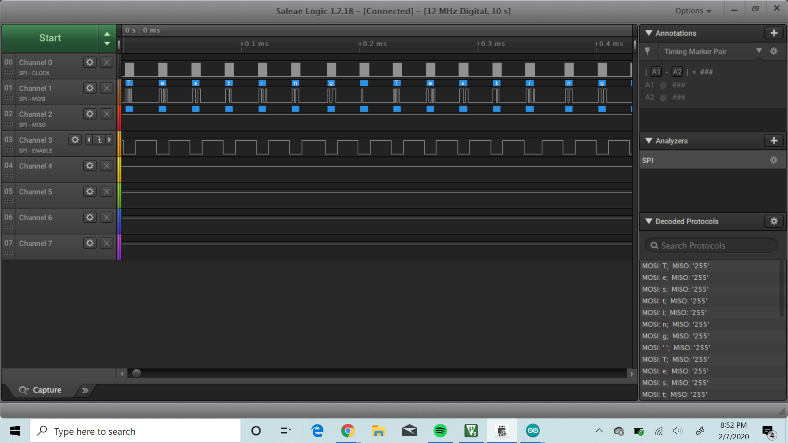

Name: Michael Chuang

EID: mrc4375

Team Number: F1

## Questions

1. Why does your program need a setup and a loop?

    your answer here

2. What is the downside to putting all your code in a loop?

    It makes the code harder to read and debug, and it might be more inefficient if there are repeated steps.

3. Why does your code need to be compiled?

    The computer needs to be able to read the program, thus the compiler translates the code to machine code. The computer (or arduino in this case) can only read machine code.

4. When lowering the frequency in procedure A, step 4, what is going wrong? Brainstorm some solutions. Dimmers exist in the real world. What is their solution?

    When we lowered the frequency, I began to notice the flickers as it became dimmer. The issue is the fact that our eyes sample at a rate of ~30Hz. We'll notice flickering anything less than that frequency. One solution is to increase the frequency above the threshold the eye can see. Another solution is to just vary the voltage instead of sending waves (although this will drain battery much faster and the device may not like the lower voltage).

5. Why do you need to connect the logic analyzer ground to the ESP32 ground?

    Ground is what the arduino and logic analyzer use as a reference. Thus, in order to measure the same voltage/output the same voltage, the devices must be using the same reference.

6. What is the difference between synchronous and asynchronous communication?

    Synchronous communication requires a clock to let the receiving device know when to recieve data while asynchronous communication does not use any sort of synchronization and just sends data when ready.

7. Profile of UART: Sent X bytes in Y time 

    Sent 36 bytes in 38.5ms

8. Profile of SPI: Sent X bytes in Y time

    Sent 36 bytes in 1.02ms

9. Why is SPI so much faster than UART?

    It has its read and write lines on different wires and it uses a synchronous communication

10. list one pro and one con of UART

    It uses less wires but it also takes a longer time to send and recieve data

11. list one pro and one con of SPI

    It is much faster form of communication/sending data, but it requires more wires

12. list one pro and one con of I2C

    It requires fewer wires compared to a SPI but it requires resistors to work

13. Why does I2C need external resistors to work?

    I2C can only pull signals to low, thus, it needs an external power source and a pull down resistor in order for it to function properly

## Screenshots

Procedure A, step 1:

Procedure A, step 4:

Procedure B, UART:

Procedure B, SPI:

